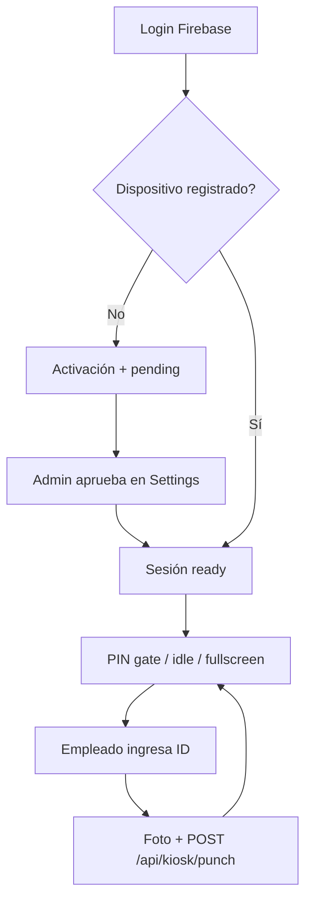

# Tanda Web — Documento técnico

**Proyecto:** `tanda-web` (Continental Cargo / TimeTracker PRO)  
**Fecha de inspección:** junio 2025  
**Estado general:** producto funcional y coherente; listo para uso operativo con mejoras recomendadas en seguridad, pruebas y documentación operativa.

---

## 1. Resumen ejecutivo

`tanda-web` es una aplicación **Next.js 16** (App Router) que centraliza la operación de Continental Cargo: administración de personal, asistencia, horarios, solicitudes de ausencia, anuncios, inspecciones de carga, portal de clientes, kiosko de fichaje y panel del empleado.

La aplicación reemplaza al kiosko nativo legacy (`tanda-app`, Expo/React Native) y consolida admin + empleado + kiosko + portal en un solo despliegue web con soporte PWA.

| Métrica | Valor aproximado |
|---------|------------------|
| Archivos en `src/` | ~441 |
| Componentes (`src/components/`) | ~139 |
| Lógica de dominio (`src/lib/`) | ~192 |
| Rutas API (`src/app/api/`) | 41 handlers |
| Tests automatizados | 0 |
| TypeScript (`tsc --noEmit`) | ✅ sin errores |

**Veredicto:** la arquitectura es clara, modular y escalable para el tamaño del producto. Los principales gaps no son de funcionalidad visible sino de **endurecimiento de seguridad**, **cobertura de pruebas** y **consistencia cliente/servidor** en permisos y escrituras a Firestore.

---

## 2. Stack tecnológico

| Capa | Tecnología |
|------|------------|
| Framework | Next.js 16.2.6 (App Router, React Server Components donde aplica) |
| UI | React 19, Tailwind CSS 4, Lucide icons |
| Gráficas | Recharts |
| Autenticación | Firebase Auth (cliente) |
| Base de datos | Cloud Firestore |
| Almacenamiento | Firebase Storage |
| Backend serverless | Route Handlers de Next.js + `firebase-admin` |
| Sesiones portal | JWT (HS256) con `jose` |
| PIN portal | `bcryptjs` |
| Notificaciones push | `web-push` + Service Worker (`public/sw.js`) |
| Kiosko (cámara) | `react-webcam`, `browser-image-compression` |
| Fechas | `date-fns` |

**Scripts npm:** `dev`, `build`, `start`, `lint` — no hay script de tests ni de seed en `package.json` actual.

---

## 3. Arquitectura

### 3.1 Estructura de carpetas

```
tanda-web/
├── src/
│   ├── app/              # App Router: páginas, layouts, API
│   ├── components/       # UI por dominio (kiosk, dashboard, employees, …)
│   ├── hooks/            # Hooks de datos y UI (~17)
│   ├── lib/              # Dominio, tipos, servicios server, utilidades
│   └── providers/        # Contextos React (auth, settings, admin access, …)
├── public/               # Assets estáticos + sw.js
├── firestore.rules       # Reglas de seguridad Firestore
├── storage.rules         # Reglas de Firebase Storage
├── docs/                 # Documentación técnica (este archivo)
└── scripts/              # Utilidades puntuales (migración, debug portal, …)
```

Alias de importación: `@/*` → `src/*`.

### 3.2 Enrutamiento (App Router)

```
/                           → Redirección según rol
/login                      → Login Firebase (email/password)
/auth/action                → Reset de contraseña (oobCode)
/kiosk                      → Kiosko standalone (fuera del shell protegido)
/portal/*                   → Portal B2B (AWB + PIN, sesión JWT aparte)
/(protected)/*              → Shell con Sidebar + Header (auth requerida)
```

**Importante:** no existe `middleware.ts`. La protección de rutas es **100 % en el cliente** (`ProtectedShell`, guards de kiosk/portal). Las páginas protegidas pueden renderizarse brevemente antes del redirect si no hay sesión.

### 3.3 Patrones recurrentes

| Patrón | Ubicación | Uso |
|--------|-----------|-----|
| Providers anidados | `ClientProviders.tsx`, `ProtectedShell.tsx` | Auth, settings, listas admin en tiempo real |
| Hooks de dominio | `src/hooks/` | `useAuthRole`, `useAdminAccess`, `useEmployeeAttendance`, … |
| Mappers Firestore → tipos | `src/lib/**/map-*.ts` | Normalización de documentos legacy |
| Clientes API | `src/lib/**/*-api.ts` | Fetch autenticado hacia Route Handlers |
| Servicios server | `src/lib/**/server/*` | Lógica con Admin SDK |
| UI compartida | `src/components/ui/` | Button, Card, PageHeader, LoadingSplash, … |

---

## 4. Módulos funcionales

### 4.1 Administración (`master` / `admin`)

| Módulo | Ruta | Descripción |
|--------|------|-------------|
| Dashboard | `/dashboard` | KPIs, gráficas configurables, filtros por fecha/ubicación |
| Asistencia | `/attendance` | Registros, edición manual, justificaciones, alertas |
| Horarios | `/schedule` | Calendario semanal/mensual, asignación de turnos |
| Empleados | `/employees` | CRUD, invitación, documentos, permisos admin |
| Anuncios | `/announcements` | Publicación y lectura |
| Leave requests | `/leave-requests` | Centro de aprobación/rechazo |
| Inspecciones | `/inspections` | Inspecciones de carga |
| Issue reports | `/issue-reports` | Reportes de incidencias (admin) |
| Help tutorials | `/help-tutorials` | Gestión de tutoriales |
| Settings | `/settings` | Localización, asistencia, notificaciones, roles, ubicaciones, kioskos, portal, auditoría, purge |

### 4.2 Empleado (`empleado`)

| Módulo | Ruta | Descripción |
|--------|------|-------------|
| Dashboard | `/employee-dashboard` | Próximo turno, horas, schedule semanal (cards colapsables) |
| My records | `/my-records` | Historial de fichajes con filtros All / 7 días / mes |
| My schedule | `/my-schedule` | Turnos asignados |
| My requests | `/my-requests` | Solicitudes de ausencia |
| Help | `/help` | Tutoriales (solo lectura) |
| Report issue | `/report-issue` | Enviar incidencia |

### 4.3 Kiosko (`/kiosk`)

Flujo completo con activación de dispositivo, aprobación admin, PIN de bloqueo, pantalla idle, captura de foto y fichaje vía API.

Componentes clave: `KioskApp`, `KioskActivation`, `KioskPinGate`, `KioskScreen`, `KioskCamera`.

### 4.4 Portal B2B (`/portal`)

Login con AWB + PIN → JWT de sesión. Consulta de inspecciones y descarga de medios. Rate limiting en verificación de PIN.

---

## 5. Autenticación, roles y permisos

### 5.1 Roles

| Rol | Home | Acceso |
|-----|------|--------|
| `master` | `/dashboard` | Acceso total; bypass de permisos granulares |
| `admin` | `/dashboard` | Módulos y acciones según plantilla `admin_roles` o permisos inline |
| `empleado` | `/employee-dashboard` | Rutas de autoservicio |
| `kiosk` | `/kiosk` | Cuenta dedicada de kiosko |

Resolución de rol: `src/lib/auth/resolve-role.ts` (campo `role` o legacy `department`).

### 5.2 Flujo de sesión

1. Firebase Auth en cliente (`AuthProvider`).
2. Lookup de empleado por email en Firestore (`employee-session.ts`).
3. Usuarios inactivos o sin perfil → sign out automático.
4. `ProtectedShell` redirige según `getRedirectForRole()` (`routes.ts`).

### 5.3 Permisos granulares (admin)

Definidos en `src/lib/types/admin-permissions.ts`:

- **11 módulos:** dashboard, attendance, schedule, employees, announcements, leaveRequests, inspections, issueReports, helpTutorials, kiosk, settings.
- **Acciones por módulo:** p. ej. employees → create, update, delete, invite.
- UI: `AdminAccessProvider` + `useAdminAccess()` → `canAccessModule`, `canPerformAction`.

**Gap conocido:** los permisos granulares se aplican en la **interfaz**, pero las APIs usan principalmente `verifyAdminRequest` / `verifyMasterRequest` sin comprobar la acción concreta. Un admin con permisos restringidos en UI podría invocar endpoints si conoce la URL.

### 5.4 Auth en APIs

| Helper | Verificación |
|--------|--------------|
| `verifyFirebaseToken` | Bearer ID token válido |
| `loadEmployeeContext` | Token + documento empleado |
| `verifyAdminRequest` | Token + rol admin o master |
| `verifyMasterRequest` | Token + rol master |

Kiosko: headers `X-Kiosk-Device-Token` y `X-Kiosk-Client-Session` además del token Firebase en fases de setup.

---

## 6. Capa de datos (Firestore)

### 6.1 Colecciones

Definidas en `src/lib/constants.ts`:

`employees`, `attendance_records`, `shifts`, `leave_requests`, `cargo_inspections`, `portal_clients`, `locations`, `departments`, `location_groups`, `kiosk_devices`, `notifications`, `notification_preferences`, `attendance_justifications`, `announcements`, `admin_roles`, `audit_logs`, `settings`, `issue_reports`, `help_tutorials`.

### 6.2 Patrón híbrido cliente / servidor

| Enfoque | Colecciones / uso |
|---------|-------------------|
| **Cliente directo** (onSnapshot, getDocs, writes) | employees, shifts, attendance (lectura), leave_requests (admin page), locations, departments, … |
| **Solo servidor** (reglas `read, write: if false`) | kiosk_devices, announcements, audit_logs, issue_reports, help_tutorials, attendance_justifications |
| **Híbrido** | attendance (lectura cliente + mutaciones admin vía API), kiosk punch (solo API) |

### 6.3 Reglas de seguridad — riesgo crítico

En `firestore.rules`:

- `employees`: **`allow read: if true`** — cualquier cliente con el SDK puede leer todos los empleados (PII: email, teléfono, pasaporte, etc.) si las reglas están desplegadas así.
- `attendance_records`: **`allow read: if true`** — registros de asistencia legibles sin autenticación.

Esto probablemente se heredó del kiosko/tablet legacy que leía Firestore sin Auth. Con el kiosko web actual (API + device token), **se recomienda restringir lecturas** a usuarios autenticados con reglas basadas en rol o mover más lecturas al servidor.

---

## 7. API (Route Handlers)

Base: `src/app/api/` — **41 endpoints** agrupados así:

| Grupo | Ejemplos | Auth |
|-------|----------|------|
| Attendance | `records`, `justifications`, `evaluate-alerts` | Admin |
| Employees | `invite`, `sync-auth`, `admin-access` | Admin / master |
| Admin roles | `admin-roles`, `admin-roles/[id]` | Master |
| Announcements | `announcements`, `[id]` | Admin |
| Leave | `leave-requests/[id]` | Admin |
| Notifications | `subscribe`, `unsubscribe`, `shift` | Autenticado |
| Settings | `settings/general` | Admin |
| Audit | `audit-logs`, `audit/events` | Master / autenticado |
| Help | `help/tutorials/*` | Lectura empleado / gestión admin |
| Issues | `issue-reports/*` | Empleado crea / admin gestiona |
| Kiosk | `devices/*`, `punch`, `lookup` | Token dispositivo + Firebase |
| Portal | `verify`, `inspections/*`, `media` | JWT portal / credenciales |
| Admin | `admin/data-purge` | Master |

Convenciones: respuestas JSON con códigos HTTP estándar; lógica en `*-service.ts`; auditoría vía `record-audit-from-request.ts`.

---

## 8. Kiosko y PWA

### 8.1 PWA

- Manifest dinámico: `src/app/manifest.webmanifest/route.ts`
- Iconos: `icon.tsx`, `apple-icon.tsx`, `pwa-icon/route.tsx`
- Service Worker: `public/sw.js` (push + navegación al hacer clic)
- Registro: `usePushNotifications`

### 8.2 Flujo kiosko



Estado local: `kiosk_device_token`, `kiosk_client_session_id` en `localStorage`. Sign out limpia caché kiosko (`clear-kiosk-session.ts`).

---

## 9. Variables de entorno

Plantilla: `.env.example`

| Variable | Ámbito | Uso |
|----------|--------|-----|
| `NEXT_PUBLIC_FIREBASE_*` | Cliente | Config web Firebase |
| `FIREBASE_SERVICE_ACCOUNT_JSON` | Servidor | Admin SDK |
| `PORTAL_SESSION_SECRET` | Servidor | Firma JWT portal (≥16 chars) |
| `NEXT_PUBLIC_VAPID_PUBLIC_KEY` | Cliente | Web push |
| `VAPID_PRIVATE_KEY`, `VAPID_SUBJECT` | Servidor | Web push |

**Nunca commitear** `.env.local` con credenciales reales.

---

## 10. Despliegue y operación

- **Target probable:** Vercel u hosting Next.js compatible.
- `next.config.ts`: optimización de imágenes Firebase Storage; headers para `sw.js`.
- `firestore.rules` y `storage.rules` están en el repo; **no hay `firebase.json` en `tanda-web`** — confirmar cómo se despliegan las reglas (manual, CI o monorepo padre).
- `README.md` es el boilerplate de create-next-app; **no documenta despliegue ni operación** del producto.

Scripts auxiliares en `scripts/`: formato de service account, debug portal, migración de tokens.

---

## 11. Fortalezas del proyecto

1. **Separación por dominio clara** — cada feature tiene componentes, lib y tipos propios.
2. **Tipado consistente** — TypeScript estricto en modelos y mappers.
3. **Permisos granulares en UI** — modelo extensible por módulo y acción.
4. **Kiosko maduro** — activación, revocación, sesión, fullscreen, limpieza al cerrar sesión.
5. **Dashboard configurable** — widgets, layout persistido, gráficas con paleta diferenciada.
6. **Auditoría** — eventos registrados en operaciones sensibles.
7. **Portal aislado** — auth separada, rate limit, PIN hasheado.
8. **PWA lista** — manifest, SW, push notifications.
9. **UX empleado pulida** — cards colapsables, filtros de records, schedule con estados visuales.

---

## 12. Riesgos y deuda técnica

| Prioridad | Área | Descripción |
|-----------|------|-------------|
| 🔴 Alta | Firestore rules | Lectura pública de `employees` y `attendance_records` |
| 🔴 Alta | API permissions | Permisos granulares no enforced server-side |
| 🟠 Media | Sin middleware | Rutas protegidas sin guard a nivel servidor |
| 🟠 Media | Escrituras mixtas | Schedule/employees escriben directo a Firestore; otras vía API — superficie de enforcement inconsistente |
| 🟠 Media | Sin tests | 0 tests unitarios/integración/e2e |
| 🟡 Baja | Auth fallback | `AuthProvider` puede defaultear a `empleado` en error transitorio |
| 🟡 Baja | Duplicación | Resolución de rol/sesión repetida cliente vs servidor |
| 🟡 Baja | README / deploy docs | Documentación operativa incompleta |
| 🟡 Baja | Legacy `tanda-app` | Carpeta Expo en monorepo si ya no se usa |

---

## 13. Recomendaciones de mejora (priorizadas)

### Corto plazo (seguridad y estabilidad)

1. **Endurecer `firestore.rules`**
   - `employees`: read solo si `request.auth != null` y (es el propio empleado, admin, o regla de kiosko acotada).
   - `attendance_records`: read autenticado; writes de kiosko solo vía fuente `kiosk-api` o eliminar writes cliente legacy.
2. **`verifyAdminAction(module, action)` en APIs**
   - Reutilizar lógica de `admin-action-permissions.ts` en cada Route Handler sensible.
3. **Middleware Next.js**
   - Redirect `/login` para rutas `(protected)` sin cookie/token; no sustituye permisos granulares pero reduce exposición.
4. **Eliminar o archivar `tanda-app`**
   - Tag git `archive/tanda-app` y borrar carpeta si ningún tablet usa el APK.

### Medio plazo (calidad y mantenimiento)

5. **Suite de tests mínima**
   - Unit: mappers, permisos, `resolve-kiosk-action`, date ranges.
   - Integration: APIs críticas (kiosk punch, portal verify, admin roles).
   - E2E opcional: login → dashboard, empleado → my-records.
6. **Unificar escrituras sensibles**
   - Migrar schedule/employees CRUD a APIs con Admin SDK donde haga falta enforcement uniforme.
7. **README operativo**
   - Despliegue, variables, deploy de reglas Firebase, flujo de kiosko en tablet.
8. **Monitoreo**
   - Sentry o similar en cliente y APIs; alertas en errores de punch/portal.

### Largo plazo (producto)

9. **Internacionalización** — UI en inglés hoy; evaluar i18n si hay usuarios hispanohablantes.
10. **Offline kiosko** — cola local de punches si cae la red (PWA + IndexedDB).
11. **Reportes exportables** — CSV/PDF desde dashboard y asistencia.
12. **CI/CD** — lint + tsc + tests en cada PR; preview deployments.

---

## 14. Diagrama de roles y rutas

```
                    ┌─────────────┐
                    │   /login    │
                    └──────┬──────┘
                           │
         ┌─────────────────┼─────────────────┐
         ▼                 ▼                 ▼
    ┌─────────┐      ┌──────────┐     ┌──────────┐
    │ master  │      │  admin   │     │ empleado │
    └────┬────┘      └────┬─────┘     └────┬─────┘
         │                │                 │
         ▼                ▼                 ▼
   /dashboard      /dashboard*      /employee-dashboard
   (todo)           (*módulos         /my-records
                    permitidos)        /my-schedule
                                       /my-requests

    ┌─────────┐                    ┌──────────────┐
    │  kiosk  │ ──► /kiosk         │ portal AWB   │ ──► /portal/*
    └─────────┘                    └──────────────┘
```

---

## 15. Checklist pre-producción

- [ ] Reglas Firestore desplegadas y revisadas (sin `read: if true` en PII)
- [ ] `.env.local` / secrets solo en el hosting, no en git
- [ ] `PORTAL_SESSION_SECRET` fuerte y único por entorno
- [ ] VAPID keys configuradas para push
- [ ] Service account con permisos mínimos necesarios
- [ ] Tablets kiosko apuntando a `/kiosk` (no APK legacy)
- [ ] `npm run build` exitoso en CI
- [ ] Backup / export Firestore documentado
- [ ] Cuenta `master` con MFA en Firebase Auth (recomendado)

---

## 16. Referencias rápidas de archivos

| Tema | Archivo |
|------|---------|
| Auth cliente | `src/providers/AuthProvider.tsx` |
| Shell protegido | `src/components/layout/ProtectedShell.tsx` |
| Permisos admin | `src/lib/types/admin-permissions.ts`, `src/lib/auth/admin-permissions.ts` |
| Kiosko orquestador | `src/components/kiosk/KioskApp.tsx` |
| Dashboard | `src/components/dashboard/DynamicDashboard.tsx` |
| Reglas DB | `firestore.rules`, `storage.rules` |
| Firebase admin | `src/lib/firebase-admin.ts` |
| Constantes | `src/lib/constants.ts` |

---

*Documento generado tras inspección estática del código. Para cambios en arquitectura o despliegue, actualizar este archivo en el mismo PR.*
