# Continental Cargo — Employee User Manual

**Audience:** Workforce employees (mobile)  
**App:** [continentalcargo.online](https://www.continentalcargo.online)  
**Language:** English  

This guide explains how to use the employee workspace on a phone: attendance, roster, leave/time-off requests, training follow-up, profile, inspections, and kiosk punch. Screenshots match the mobile layout.

---

## 1. Sign in

The login page is the entry to the workforce operations platform (attendance, scheduling, leave, and compliance tools).

1. Open **https://www.continentalcargo.online** in your browser (phone browser is fine).
2. Enter your **company email** and **password** (credentials issued by your administrator).
3. Tap **Sign in**.

If the password fails, the account is locked, or you never received credentials, contact your **system administrator**. Do not share passwords in chat or email.

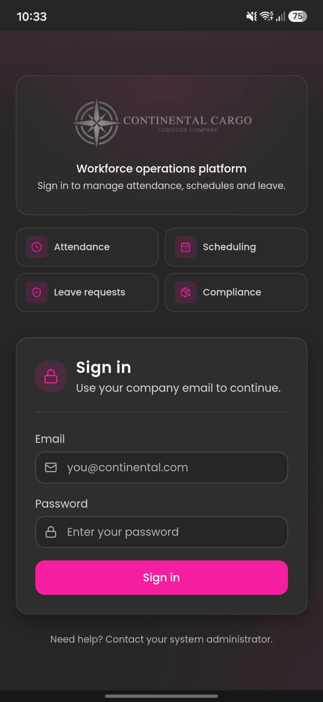

---

## 2. Home — My overview

After sign-in you land on **My overview** — your daily hub. On a phone, **scroll down**: several cards sit below the first screen.

Header actions:

- **Refresh** — reloads hours, shifts, and schedule cards with the latest data from the server.
- **Bell** — opens notifications (see Notifications).
- **Profile photo** — account shortcuts / profile access.

### Your employee ID

Shows your **four-digit employee ID** in large digits. Use this number at the warehouse **time clock / kiosk** when you clock in or out — **not** your password or email.

### Hours & earnings

Tracks how much you have worked in the selected period:

- Switch **This week**, **Last week**, or **This month**.
- See **billable hours** and a progress bar toward your personal goal (default **Goal 40 hrs**).
- Tap the **pencil** next to the goal to edit your own hours target (this does not change company payroll rules).
- **Earnings** (pay estimate) appear only after an administrator sets your hourly rate. Until then you still see hours.

### My next shift

Highlights the next shift on your roster (date, time, and site when published). If nothing is assigned yet: **No upcoming shifts**.

### My schedule (this week)

Mini weekly view on the home screen:

- Date range and how many shifts you have this week.
- Day cards: **Scheduled**, **Completed**, **Absent**, or **Day off**.
- Tap **Full schedule** to open the full **My schedule** page for confirmation and detail.

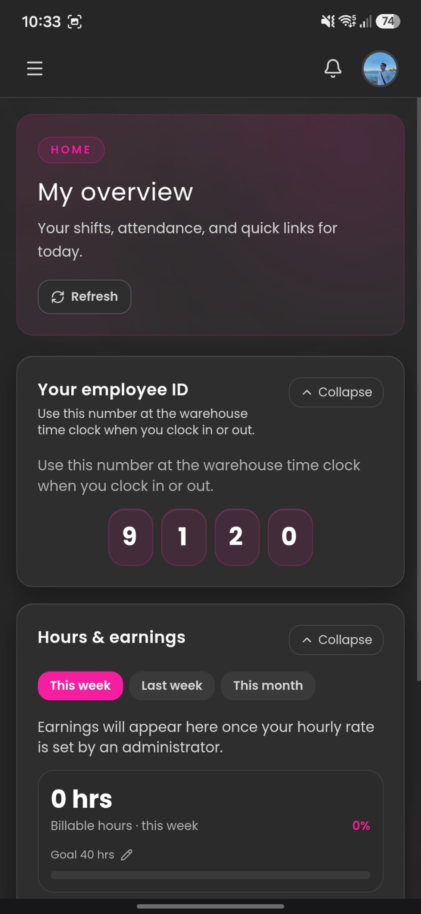

---

## 3. Mobile navigation

1. Tap the **menu** (three lines) at the top left to open the side drawer.
2. Tap a destination. Close with **X** (or the overlay) when you are done.

| Group | What it is for |
|---|---|
| **Overview** — My dashboard | Home: ID, hours, next shift, week preview |
| **My work** — My records | Check-ins/outs, photo verification, worked shift blocks |
| **My work** — My schedule | Full roster, confirm attendance for assigned shifts |
| **My work** — My leave | Request vacation, leave, and other time-off / permissions |
| **My work** — My courses | Training tracking: links, evidence, mark complete → admin approval |
| **My work** — My profile | Personal data you must complete; admin must approve |
| **Support** — Announcements | Company messages for your department / location |
| **Support** — Settings | Account / app preferences (as enabled for your role) |
| **Support** — Help | Guides, videos, PDFs matched to your role |
| **Support** — Report issue | Tickets for app, kiosk, schedule, or account problems |
| **Compliance** — Inspections | ULD / AWB cargo intake records (if enabled) |
| **Kiosk** — Kiosk check-in | On-site time clock (PIN, geofence; NFC/QR if enabled) |

Footer of the menu shows your company and role (**Employee**).

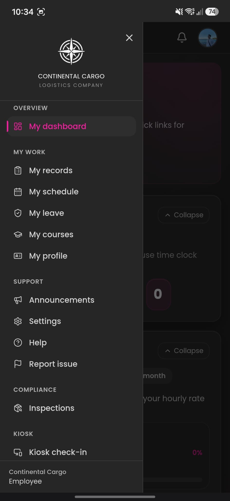

---

## 4. My schedule

Managers **assign your shifts** in the roster. When a roster is published you typically receive an **email** with the schedule assignment. Always open **My schedule** in the app as well — the app is the place where you act on the assignment.

**Important:** After shifts are assigned, you must **confirm your attendance** (accept / confirm that you will work those shifts). Do not ignore assignment emails; check the app and confirm promptly so operations can plan coverage.

On this page you can:

- See the **weekly calendar** with day status (**Scheduled**, **Completed**, **Absent**, **Day off**).
- Review **Upcoming shifts** in chronological order (times and locations when published).
- Tap **Refresh** after your manager changes the roster.

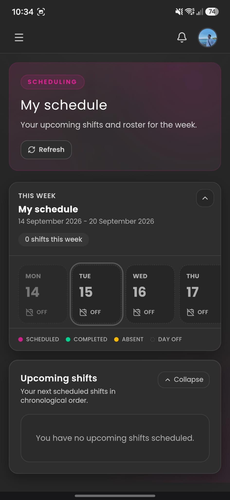

### Confirm attendance

Use the confirmation screen to **accept the shifts assigned to you**. Until you confirm, planners may not treat the roster as locked for you. If you cannot work a shift, contact your manager immediately (and use leave / absence processes as required).

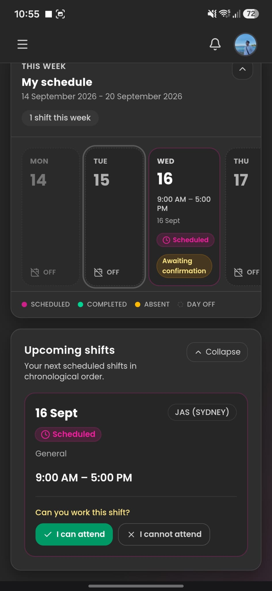

---

## 4b. Notifications

Tap the **bell** in the header to open the notifications panel.

Typical alerts include: new or changed **shift assignments**, reminders to **confirm attendance**, **announcements**, training deadlines, and other operational messages.

- When the browser or phone asks, **allow notifications** (push) so you do not miss roster changes or urgent messages.
- You can still open the bell and read recent alerts if push is off — enabling notifications is strongly recommended.
- Clear or open items as you review them so you do not miss new ones.

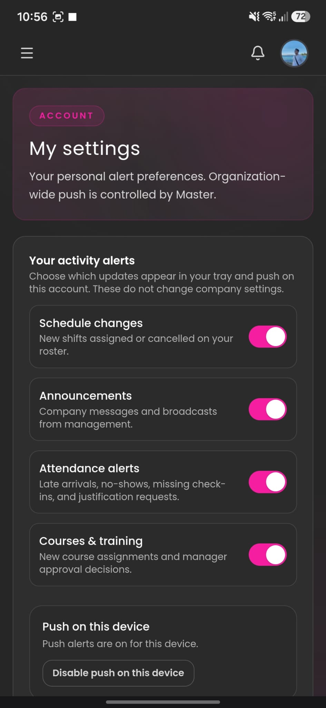

---

## 5. My attendance records

**My records** is your attendance history: **check-ins**, **check-outs**, and any **photo verification** tied to punches.

1. Open **My records** from the menu.
2. Filter with **All**, **Last 7 days**, or **This month** to narrow the list.
3. Tap a record (when available) to see detail for that punch.
4. Tap **Refresh** if a punch you just made does not appear yet.

### Worked shifts

Tap **Worked shifts** to open **complete work blocks** — each finished shift as a block (start, end, duration, and related attendance detail), not only raw punch lines. Use this to review a full day’s worked time or to reconcile hours with your manager.

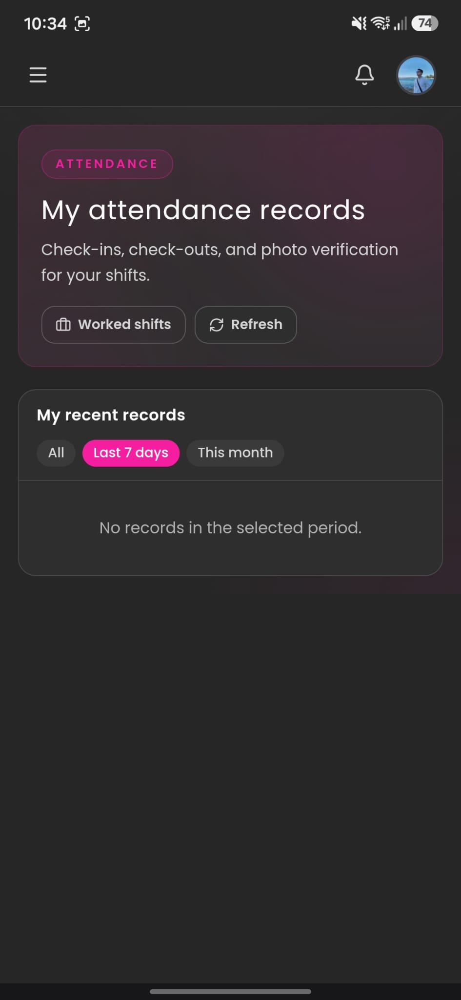

### Late arrivals and absences — justification

If you were **late** or **absent**, you may need to submit a **justification** so your manager / administrator can review and decide how to treat the day (approved absence, late explanation, etc.). Follow the on-screen form: select the event, explain the reason, attach evidence if requested, and submit for review.

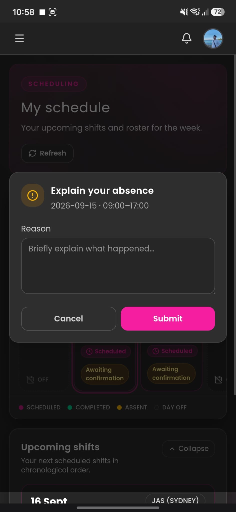

---

## 6. Announcements

**Announcements** is the company notice board filtered to **your department and location**.

- Open it regularly for operational updates, policy notes, and site messages.
- Messages are pushed according to how admins target staff — if the list is empty, nothing is targeted to your profile yet.
- Prefer the app (and notifications) over informal channels for official communications.

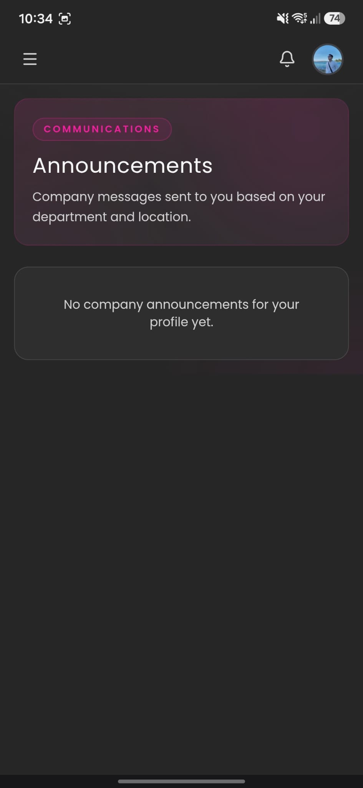

---

## 7. My leave (time off & permissions)

**My leave** is where you **request time off and permissions** — for example **vacation / annual leave**, personal leave, sick leave (as configured), or other absence types your company defines. It is **not** the same as confirming a rostered shift; use this when you need approved leave away from work.

### What you can do

- Submit a **new leave / permission request** with type, dates, and reason.
- Track every request under **Request history** (pending, approved, or rejected).
- Tap **Refresh** after you submit or when waiting for a manager decision.

### How to submit a request

1. Open **My leave**.
2. Under **New request**, choose **Leave type** (for example **Vacation**, or the type that matches your permission).
3. Set **From** and **To** dates for the period you need off.
4. Write a clear **Justification** (why you need the leave / permission).
5. Tap **SUBMIT REQUEST**.

An administrator or manager reviews the request. Until it is approved, do **not** assume the days are cleared on the roster — wait for the status change in **Request history**, and confirm with your manager if unsure.

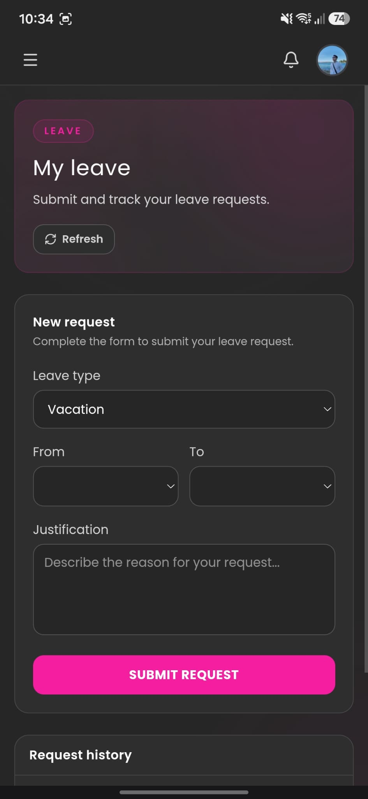

---

## 8. My courses (training tracking)

**My courses** is the **training follow-up and compliance tracker** — it does **not** replace the external learning platform.

When a course is assigned to you:

1. Open the course card in **My courses** (deadline and status are shown here).
2. Open the **access link** provided for that course — it takes you to the **corresponding training platform** (external LMS / provider) to complete the actual learning.
3. After you finish there, return to Continental Cargo, **upload evidence** (certificate, screenshot, file, or whatever the course asks for), and **mark the course as completed**.
4. An **administrator must approve** your submission. Until approval, status stays **Awaiting review**.

| Status | Meaning |
|---|---|
| Still to do | Assigned; learning not finished / not marked complete |
| Awaiting review | Evidence uploaded and marked complete; waiting for admin |
| Approved | Administrator accepted your completion |

Finish before the **deadline**. If you see “No courses assigned yet,” wait for your manager to assign training. Incomplete or unapproved courses may affect compliance requirements for your role.

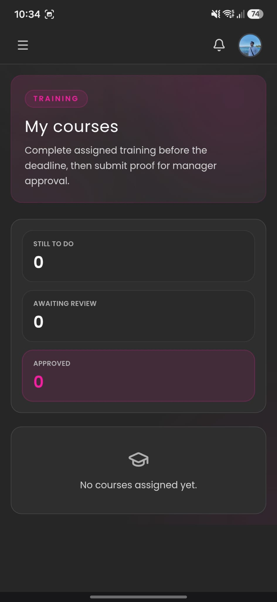

---

## 9. My profile (required)

**You must complete your personal profile.** A complete staff file needs your personal and contact data, submitted for **administrator approval**.

1. Add or update your **profile photo** (recommended so staff can identify you).
2. Fill **personal details**: contact information, home address, and any documents the form requests.
3. Tap **Submit for review**.
4. Status shows **Pending review** until an admin **approves** or **rejects** the profile.

Treat **Pending review** / rejected as **incomplete**. If rejected, fix what the admin asked for and submit again. Keeping profile data up to date also helps for emergencies and payroll contact.

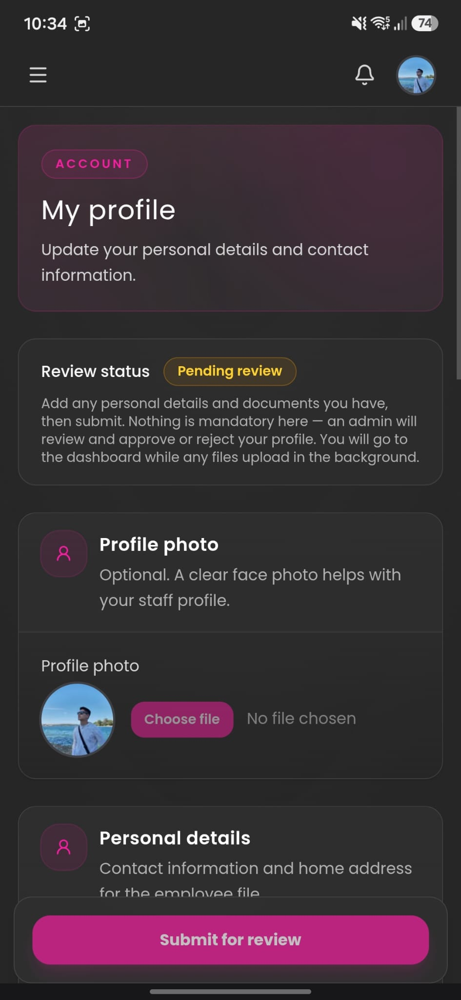

---

## 10. Report an issue

**Report issue** opens a support ticket to your administrators when something is wrong with the **app**, **kiosk**, **schedule**, or **account**.

1. Choose a **Category** (for example Bug / technical).
2. Enter a short **Subject** (one-line summary).
3. In **Description**, explain what happened and steps to reproduce if it is a bug.
4. Optionally **Attach screenshot**.
5. Tap **Submit report**.

Your administrator reviews the ticket and updates its status. Use this instead of informal messages when you need a tracked fix.

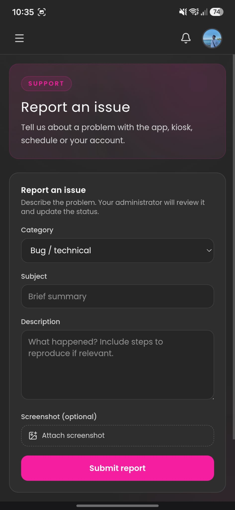

---

## 11. Cargo inspections

If **Inspections** is enabled for your role, you register **ULD / AWB warehouse intake** records. Data is shared with the Continental Inspect mobile workflow where applicable.

### List view

- Counters such as **New today**, **Loaded today**, and **Attention** summarise activity.
- Tap **+ Register new** to start a record.
- **Search** by ULD, AWB, or food type.
- Filter **Today**, **This week**, **This month**, or **Custom**.
- **Export CSV** when you need a spreadsheet for reporting.
- Tap **Refresh** to reload the list.

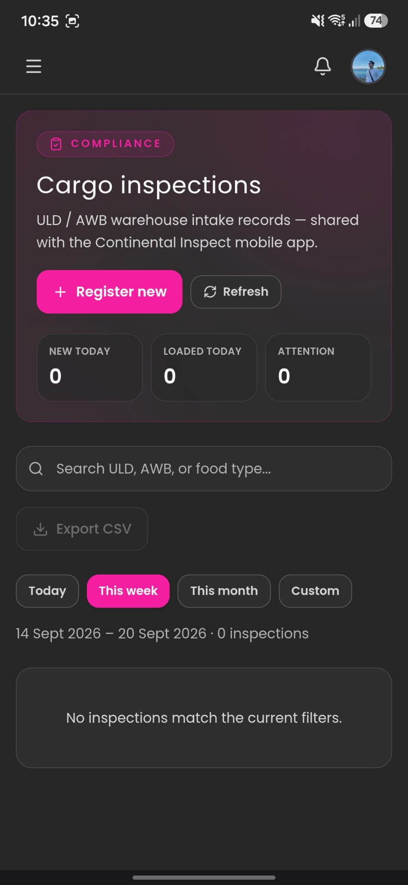

### New inspection

Scroll the full form. **GPS is captured when you save.**

**Identification**

1. **ULD ID** (optional) and **Air waybill (AWB)**.
2. **Cargo category**: LCL, Pallet / Skid, Loose cargo, or Breakbulk.
3. **Client** (required for the intake).

**Cargo details** (product, conservation, weight, condition)

4. **Conservation type**: Frozen, Refrigerated, or Ambient.
5. **Food type**, **Weight (kg)**, **Box count**.
6. Optional **Temperature (°C)**.
7. **Damage / Issues detected?** — turn on for damage, temperature breach, or documentation problems.

**Outbound transport** (optional)

8. **Exit vehicle plate**, **Driver name**, **Transport company**.

**Evidence**

9. **Photos** — Take photo or Gallery (optimized after save, ≤ 3 MB each).
10. **Videos** — Record or Upload (original quality after save; no size/duration limit).
11. Tap **Save inspection**. The record saves immediately; media keeps uploading in the background — **keep the tab open until the progress bar finishes**.

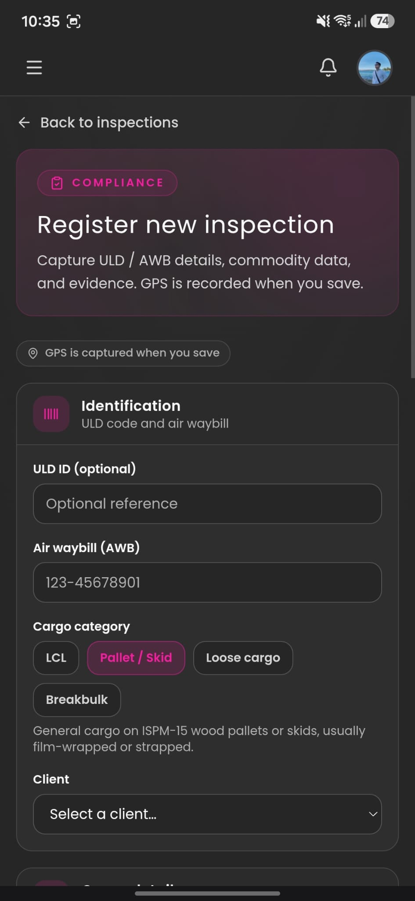

---

## 12. Kiosk check-in

**Kiosk check-in** is the on-site **time clock** for clock-in / clock-out at the workplace.

1. Confirm the location line (for example **Clocking in at: …**).
2. Enter your **4-digit employee ID** (same as on My overview).
3. Tap **Continue**.
4. Follow prompts for check-in or check-out (photo and/or location may be required depending on site settings).

### Location check (geofence)

The kiosk checks that you are within about **200 metres** of the **work location** configured for that site. Outside that range the punch may fail — move closer and retry.

### NFC or QR (if enabled)

If your administrator enables them, you can clock in/out with **NFC** or by scanning a **QR** code, instead of (or as well as) typing your ID on the keypad. Ask your manager which options your site uses.

**Tips**

- Allow **location** when the browser asks.
- Use the dashboard ID, not your password.
- Tap **Exit** to leave the kiosk and return to the employee app.

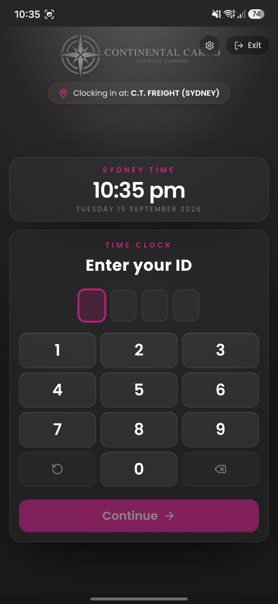

---

## 13. Help & guides

**Help & guides** lists **videos, PDFs, documents, and links** matched to your **role, department, and location**.

Open a guide when you need step-by-step help beyond this manual. If none appear yet, ask your administrator to publish employee help content.

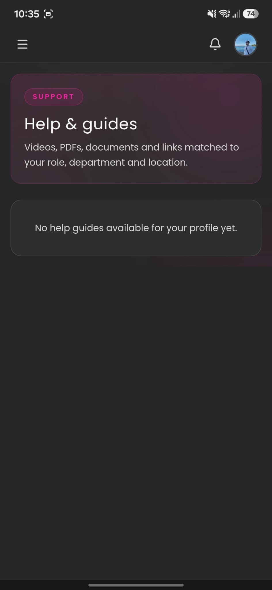

---

## 14. Quick tips

| Topic | What to do |
|---|---|
| Forgot password | Ask your administrator to reset it. |
| Wrong employee ID at kiosk | Check **Your employee ID** on My overview. |
| Punch failed / outside range | Stay within ~200 m of the work location; confirm location permission. |
| NFC / QR not available | Ask your admin — only if enabled for your site. |
| Missing shift / no email | Check spam; open My schedule + Refresh; **confirm attendance**. |
| Need vacation / time off | Use **My leave** — submit type, dates, justification; wait for approval. |
| Late or absent | Submit a **justification** (late / absence) for manager review. |
| Profile Pending review | Complete personal data; wait for admin approval (or fix and resubmit). |
| Course awaiting review | Finish external training, upload evidence, mark complete; wait for admin. |
| Earnings blank | Wait until an admin sets your hourly rate. |
| App looks wrong on phone | Use the phone browser; open the menu from the top-left icon. |

---

*Continental Cargo Workspace — Employee guide (mobile). For payroll and accounting detail, see the separate Holly / Accounting guide.*
